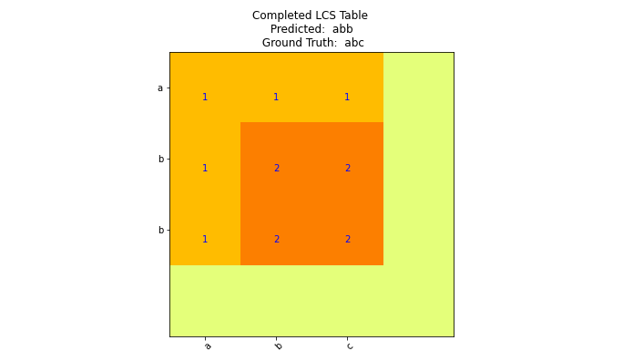

# DI-Metrics: Metrics for Hierarchical Document Information Extraction Evaluation


## Introduction
`DIME` is a library devoted to providing a common evaluation framework for DI tasks. For more details see our paper describing implemented methods and approach.  <br/>

Purpose of DIME:<br/>

1.  `Model Benchmarking`: <br/> Provide a *Reliable* and *Replicable* Python package of tests to compare model performance and error analysis for semi-structured document information extraction tasks.
   
2.  `Living, Collaborative Repository`: <br/> Provide an environment for collaborators to contribute metrics to maintained library for ensured standardizationk.<br/>

3. `Learning over discrete metrics` <br/>

## Paper
[Document Intelligence Metrics for Visually Rich Document Evaluation]([https://tbd.tbd.com](https://arxiv.org/pdf/2205.11215.pdf))
<br/>


## Install

~~~ shell
#pip install -e .
export CUDA_HOME=/usr/local/cuda-X.X python setup.py install
~~~

You will also need to install gcc compiler if not already installed:
`conda install gcc_linux-64`

## Getting Started 

~~~ python
from dime.textual import lc_subsequence

ref = "abcabcabcabcabcabcabc"
pred = "abcabcabdddcabcabcabc"
(p, r, f1),dp_table = lc_subsequence(pred,ref,ret_dp_table=True)
~~~


## Currently implemented metrics
Currently implemented metrics can be found in `dime`. All code is in Python 3.

* Levenshtine Distance
* Longest Common Substring Distance
* Intersection over Union (Convex Hull, Grouped)
* Intersection over Union (by constituent bounding box) (credit: DocBank)
* Hierarchical Edit Distance
* Tree Edit Distance (for Tables) (credit: IBM)
* Hungarian Algorithm. We frame class-to-line item grouping as a credit assignment problem. We use bi-partite graph matching and Hungarian algorithm for some evaluation approaches with nested fields using Hungarian Algorithm.


## Example Evaluations
See `Evaluations` to view example code for evaluations of models and datasets RVLCDIP-I and CORD.

## Citation

``` latex
@misc{https://doi.org/10.48550/arxiv.2205.11215,
  doi = {10.48550/ARXIV.2205.11215}, 
  url = {https://arxiv.org/abs/2205.11215},
  author = {DeGange, Jonathan and Gupta, Swapnil and Han, Zhuoyu and Wilkosz, Krzysztof and Karwan, Adam},
  keywords = {Artificial Intelligence (cs.AI), FOS: Computer and information sciences, FOS: Computer and information sciences},
  title = {Document Intelligence Metrics for Visually Rich Document Evaluation},
  publisher = {arXiv},
  year = {2022},
  copyright = {Creative Commons Attribution Non Commercial No Derivatives 4.0 International}
}

```
